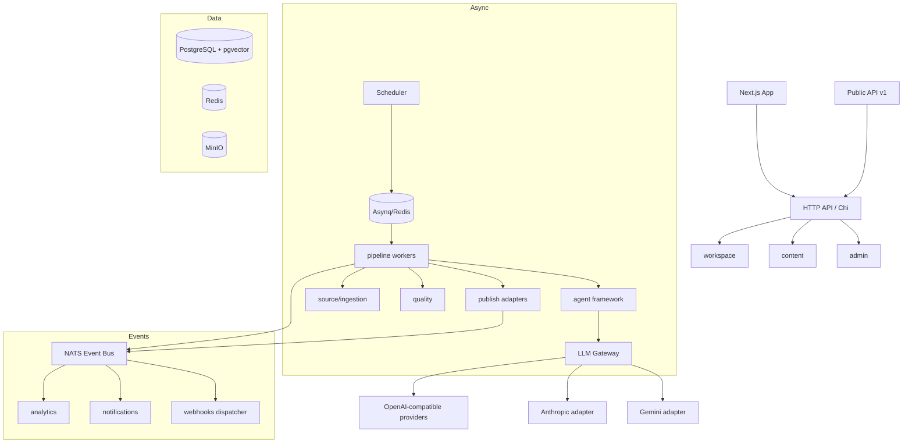

# DES-ARCH — System Architecture

**Статус:** Draft · **Реализует:** REQ-WS-*, REQ-EXT-*, Constitution II–V

---

## 1. Стиль архитектуры

- **Clean Architecture** + элементы **DDD** (bounded contexts = модули).
- **Modular Monolith** на старте: одно Go-приложение, жёсткие границы модулей.
- Кандидаты на выделение в микросервисы (Phase 3): AI Service, Scheduler, Analytics,
  Billing, Search, Notification — их контракты уже сейчас проектируются как сетевые.

### Почему Modular Monolith

MVP значительно быстрее; при этом выделение сервисов безболезненно, поскольку модули
общаются только через интерфейсы (`internal/contract`) и Event Bus (Constitution IV).

## 2. Технологический стек

| Слой | Технологии |
|---|---|
| Backend | Go 1.26+, Chi (HTTP router), sqlc/pgx |
| Хранилища | PostgreSQL 16 (+pgvector), Redis, MinIO (S3) |
| Очереди/Workflow | Asynq (MVP) → Temporal (Phase 2), NATS (Event Bus) |
| Поиск | Postgres FTS (MVP) → Meilisearch/OpenSearch (Phase 2) |
| Frontend | Next.js (React), TailwindCSS, shadcn/ui |
| Infra | Docker Compose, Traefik, Prometheus, Grafana |

Выбор Chi vs Fiber: Chi — из-за совместимости с `net/http` (middleware-экосистема,
стандартный `context`); решение можно пересмотреть в ADR при появлении требований
к производительности, которых Chi не закрывает.

## 3. Структура репозитория (backend)

```
contentos/
├── cmd/
│   ├── server/            # HTTP API
│   ├── worker/            # Asynq workers (pipeline, ingestion, analytics)
│   └── migrate/           # миграции
├── internal/
│   ├── contract/          # интерфейсы междумодульного общения (единственная точка связности)
│   ├── platform/          # инфраструктура: db, redis, s3, eventbus, secrets, telemetry
│   ├── llm/               # LLM Gateway (см. design/llm-gateway.md)
│   ├── workspace/         # workspaces, channels, team, RBAC        (REQ-WS-*)
│   ├── style/             # brand, personality, style learning       (REQ-STYLE-*)
│   ├── source/            # sources, ingestion, dedup, RAG           (REQ-SRC-*)
│   ├── pipeline/          # оркестрация конвейера, stage config      (REQ-PIPE-*)
│   ├── agent/             # agent framework, memory, инструменты     (REQ-AGENT-*)
│   ├── content/           # материалы, версии, календарь             (REQ-PUB-*)
│   ├── publish/           # publisher-адаптеры                       (REQ-PUB-030+)
│   ├── quality/           # quality score, факты, плагиат, политика  (REQ-QS-*)
│   ├── analytics/         # метрики, feedback loop, эксперименты     (REQ-AN-*)
│   ├── billing/           # тарифы, usage, платежи                   (REQ-BILL-*)
│   ├── apiplatform/       # public API, api-keys, webhooks           (REQ-EXT-00x/01x)
│   └── admin/             # админка платформы: провайдеры, модели, промпты, тарифы
├── pkg/                   # переиспользуемое без доменной логики
└── api/                   # OpenAPI, protobuf (контракты плагинов)
```

### Правила границ (enforced arch-тестом)

1. `internal/<module>` не импортирует другой `internal/<module>` напрямую —
   только `internal/contract` и события.
2. SDK LLM-провайдеров импортируются только внутри `internal/llm` (REQ-LLM-001).
3. `internal/platform` не импортирует доменные модули (направление зависимостей
   строго внутрь).

## 4. Компонентная диаграмма



## 5. Event Bus

- Транспорт: NATS JetStream (durable consumers, replay).
- Схемы событий: versioned JSON (`event_type`, `event_version`, `occurred_at`,
  `workspace_id`, `channel_id`, payload). Реестр схем — в `api/events/`.
- Базовые события: `PipelineStarted/StageCompleted/PipelineFailed`,
  `ArticleGenerated`, `ApprovalRequested`, `PostPublished/PostFailed`,
  `SourceUpdated/SourceDegraded`, `FeedbackCollected`, `SubscriptionChanged`,
  `QuotaExceeded`, `PaymentFailed`.
- Гарантии: at-least-once; подписчики идемпотентны (dedup по `event_id`).

## 6. Multi-tenancy и безопасность

- Каждая доменная таблица несёт `workspace_id` (и `channel_id`, где применимо);
  каждый запрос проходит tenancy middleware (REQ-WS-004).
- AuthN: session-JWT для UI, API-ключи со скоупами для Public API (REQ-EXT-002).
- AuthZ: матрица ролей из `requirements/01-workspace-channels.md`, проверка
  в middleware, не в UI.
- Secrets Manager: таблица `secrets` с envelope-шифрованием (AES-256-GCM, master key
  из env/KMS); доступ на чтение — только модулям `llm`, `source`, `publish` через
  контракт; значения никогда не сериализуются в логи и API (REQ-LLM-023).
- Защита от prompt injection из источников: контент источников всегда передаётся
  агентам как данные (отдельное поле контекста), системные инструкции — только из
  Prompt Library; выход агентов проходит пост-фильтры (REQ-QS-020).

## 7. Public API и webhooks

- REST `/api/v1`, OpenAPI генерируется из кода (REQ-EXT-004).
- Webhooks dispatcher — подписчик Event Bus: маппинг событий на endpoint'ы
  пользователя, HMAC-подпись, ретраи с backoff, DLQ (REQ-EXT-011).

## 8. Plugin SDK (Phase 3)

- Контракты плагинов — protobuf в `api/plugins/`; исполнение — отдельные процессы
  (hashicorp/go-plugin поверх gRPC) с ресурсными лимитами (REQ-EXT-031).
- Манифест разрешений плагина проверяется при установке (REQ-EXT-032).

## 9. Путь к микросервисам

| Модуль | Триггер выделения | Готовность |
|---|---|---|
| llm (AI Service) | GPU/квоты, независимое масштабирование | контракт = интерфейс Provider + gRPC |
| pipeline/scheduler | объём фоновых задач | Temporal сам по себе внешний |
| analytics | объём time series | читает только Event Bus |
| billing | PCI-изоляция | общается только контрактом Usage |

## 10. ADR

Архитектурные решения фиксируются в `design/adr/NNN-title.md`
(формат: Context → Decision → Consequences). Первые ADR:
001 Chi vs Fiber, 002 Asynq → Temporal, 003 NATS vs Kafka, 004 sqlc vs ORM.
